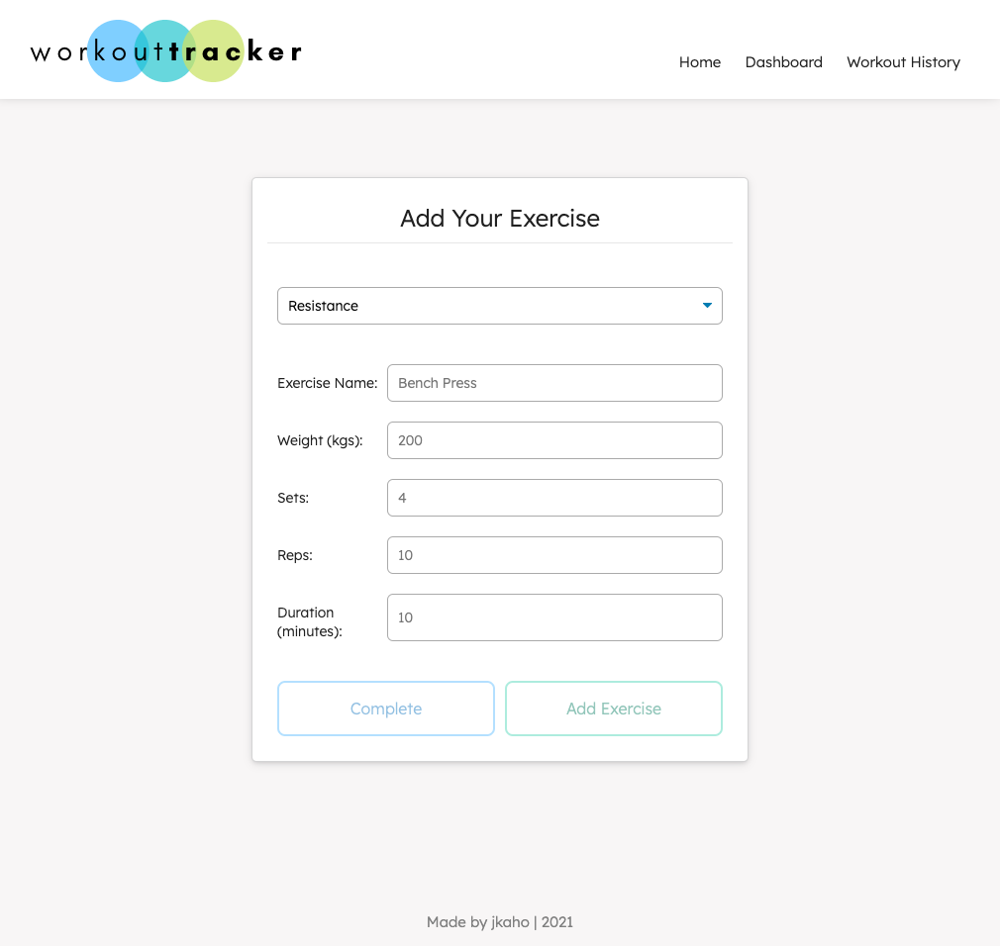

# Workout Tracker

## Description 
*Workout Tracker* is a responsive full stack application to help people keep track of their workouts. On the homepage, users can choose to either add exercises to their last workout (if it exists) or to create a new workout to add exercises to. Additionally, users can view the stats for their last seven workouts on the dashboard page, and can also view all of their previous workouts on the history page. 

## Table of Contents
- [Development](#Development)
- [Instructions](#Instructions)
- [Technologies Used](#Technologies-Used)
- [Screenshots](#Screenshots)
- [Link to Deployed App](#Link)
- [Questions](#Questions)

## Instructions
1. On the homepage, choose to add an exercise to the last workout or to a new workout.
2. On the exercise page, choose to add either a resistance or cardio exercise and fill in the required details.
3. After filling in the exercise details, choose to either add another exercise to the workout or to complete the workout and return to the homepage.
4. Navigate to the 'Dashboard' page to view the stats for the past seven workouts.
5. Navigate to the 'Workout History' page to view and/or delete past workouts. 

## Development
The objective of this project was to build the backend to the existing front-end UI. Additional code that was added to the frontend includes: 
- Workout history page
- Functionality to delete workouts
- Changes to mislabelled charts on dashboard page
- General style changes on all pages
- Responsive design

## Technologies Used 
- Node.js
- Express
- JavaScript
- MongoDB / MongoDB Atlas
- Mongoose 
- Robo 3T
- nodemon 
- Chart.js
- HTML 
- CSS 
- Google Fonts
- Font Awesome
- Canva

## Screenshots

### Homepage

### Exercise Page

### Workout Dashboard Page

### Workout History Page

## Link
Link to deployed application: [jkaho-workout-tracker.herokuapp.com](https://jkaho-workout-tracker.herokuapp.com/)

## Questions
**My GitHub Profile:** [jkaho](https://github.com/jkaho)

If you have any further questions, feel free to email me at [j.h_7@yahoo.com](mailto:j.h_7@yahoo.com)
