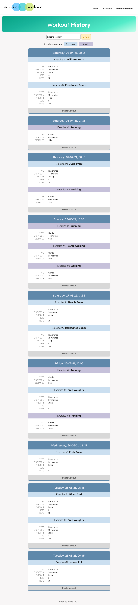

# Workout Tracker

## Description 
*Workout Tracker* is a responsive full stack application to help people keep track of their workouts. On the homepage, users can choose to either add exercises to their last workout (if it exists) or to create a new workout to add exercises to. Additionally, users can view the stats for their last seven workouts on the dashboard page, and can also view all of their previous workouts on the history page. 

## Development
The objective of this project was to build the backend to the existing front-end UI. Additional code that was added to the frontend includes: 
- Functionality to delete workouts
- Workout history page
- General style changes on all pages
- Responsive design

## Technologies Used 
- Node.js
- Express
- JavaScript
- MongoDB
- Mongoose 
- Robo 3T
- nodemon 
- Chart.js
- HTML 
- CSS 
- Google Fonts
- Font Awesome
- Canva

## Screenshots

### Homepage

### Exercise Page

### Workout Dashboard Page

### Workout History Page

## Link
Link to deployed application: [jkaho-workout-tracker.herokuapp.com](https://jkaho-workout-tracker.herokuapp.com/)

